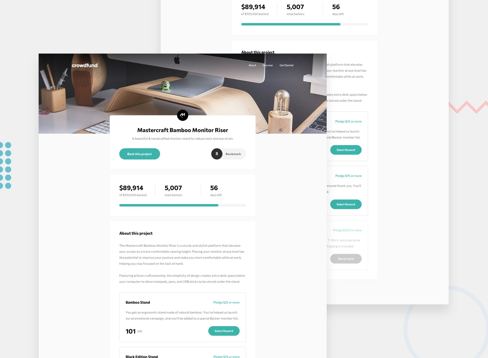

# Frontend Mentor - Crowdfunding product page

## Overview

I'm back to studying programming and I've started with the good old HTML and CSS, now I'm relearning JavaScript and TypeScript. After finishing the course I'm tackling some [Frontend Mentor](https://www.frontendmentor.io) challenges to put into practice everything I've learned as I continue my studies. It's also a great way to keep improving - while not forgetting everything I've learned - as I continue to learn new things.

### Live Demo

- [Live Demo](https://nexus-kuro-vortex.netlify.app)
- [Frontend Mentor Solution](https://www.frontendmentor.io/solutions/intro-section-with-dropdown-navigation-9Lxu6GFZOB)

## Frontend Mentor

[Frontend Mentor](https://www.frontendmentor.io) challenges help you improve your coding skills by building realistic projects.

The challenges are pretty straight forward, you have to replicate the page or element as closely as possible as the initial image or Figma layout - when provided.

### The challenge

Your challenge is to build out this crowdfunding product page and get it looking as close to the design as possible.

You can use any tools you like to help you complete the challenge. So if you've got something you'd like to practice, feel free to give it a go.

Your users should be able to:

- View the optimal layout depending on their device's screen size
- See hover states for interactive elements
- Make a selection of which pledge to make
- See an updated progress bar and total money raised based on their pledge total after confirming a pledge
- See the number of total backers increment by one after confirming a pledge
- Toggle whether or not the product is bookmarked

## What I've Learned

### Simulated Backend with JSON + localStorage

The core idea behind this implementation was to treat the HTML as a minimal, generic skeleton — just the structural scaffolding — with all meaningful content rendered dynamically through TypeScript. A static `campaign.json` served from the `public/` folder and fetched at runtime acts as the data source, simulating an API response that drives everything: page content, pledge options, stats, and the modal form cards. Nothing is hardcoded in the HTML beyond what's truly static.

User state and interaction history are persisted in `localStorage` as a single serialized object, with a type predicate validating the structure on every read before trusting the data. Together these two sources function as a pseudo-database: the JSON provides the baseline, localStorage accumulates the user's contributions on top of it, and every stat shown on the page is derived fresh from both sources on each render — never stored redundantly.

Because the first visit date is saved, the campaign countdown is relative to each visitor: anyone who opens the page sees 56 days remaining from their first visit, so the demo stays fully functional regardless of when it's viewed - you can comeback 56 days later and see that the campaign has ended, and the page will reflect that state.

### Campaign State Handling

Three distinct campaign states are handled beyond the base challenge requirements:

- **Active**: pledge selection and submission work normally.
- **Goal reached**: a success message appears in the stats section; pledging remains open.
- **Campaign ended**: triggered when the calculated days left reaches zero. If the funding goal was met, a success message is shown. If it wasn't, a separate message communicates that the campaign closed without reaching its target. In both cases, the "Back this project" button and all pledge option buttons are disabled and updated with contextual text, and an `aria-describedby` attribute on each button points to the explanatory message — so the reason for being disabled is communicated to screen readers, not just visually conveyed.

### Accessibility

Accessibility was treated as a first-class requirement throughout, not an afterthought:

- `<fieldset>`/`<legend>` groups the pledge options so screen readers announce the group context before each individual option.
- `aria-describedby` on radio inputs points to the "left" quantity for each option — giving screen reader users the availability information without needing to read surrounding text separately.
- `aria-invalid` and a dynamically associated `aria-describedby` on the pledge amount input communicate validation state and error message to assistive technology, added and removed as the user types.
- `aria-pressed` on the bookmark button reflects the toggle state.
- `aria-expanded` on the mobile menu toggle stays in sync with the visual state via the same function that toggles the menu classes — the two can never drift apart.
- Focus is moved to the selected radio and scrolled into view when opening the modal from a pledge card button, giving keyboard and screen reader users a clear entry point.

### TypeScript Architecture

The codebase is split into focused modules by responsibility: data fetching and localStorage access, rendering functions (separated into stats, options, form, and shared card utilities), modal utilities, menu setup, and a single entry point that orchestrates initialization and event listener setup.

Type predicates validate data coming out of localStorage at the boundary, before it's trusted anywhere else in the application — a pattern that mirrors what you'd do with an actual API response.

## Built With

- Markup: HTML5, Semantic Elements
- Styling: CSS3 (Grid, Flexbox, Fluid Spacing using clamp()), BEM Architecture
- Logic & Tooling: TypeScript, Vite, Bun

## Author

[@psudo-dev](https://github.com/psudo-dev)

## License

This project is licensed under the MIT License - see the [LICENSE.md](./LICENSE.md) file for details
